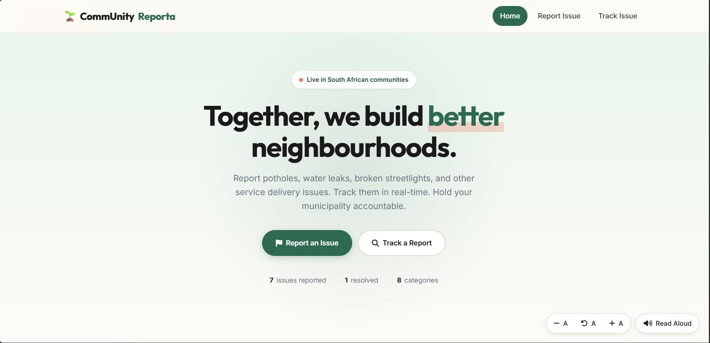

# CommUnity Reporta

**🔗 Live demo: [community-reporta.vercel.app](https://community-reporta.vercel.app)**

A community service delivery platform for reporting and tracking issues like potholes, water leaks, and electricity faults in South Africa.



## Features

- **Report issues** with photo upload, address geocoding, and category selection
- **Interactive community map** (Leaflet + OpenStreetMap) showing all reported issues
- **Track reports** by reference number with a visual progress timeline
- **Accessibility controls** — font size adjustment, read-aloud (Web Speech API), keyboard shortcuts
- **Live statistics** on the homepage pulled from the reports API
- **Mobile responsive** — works on phones, tablets, and desktops

## Tech Stack

- **Backend:** Django 6, SQLite
- **Frontend:** Vanilla JavaScript, Font Awesome, Leaflet
- **Geocoding:** OpenStreetMap Nominatim API
- **Deployment:** Render

## Local Setup

### Prerequisites

- Python 3.10+
- Git

### Installation

```bash
# Clone the repo
git clone https://github.com/chacha-debug/community-reporta.git
cd community-reporta

# Create and activate virtual environment
python -m venv venv
venv\Scripts\activate       # Windows
# source venv/bin/activate  # macOS / Linux

# Install dependencies
pip install -r requirements.txt

# Set up environment variables
cp .env.example .env
# Edit .env and set your own SECRET_KEY

# Run migrations
python manage.py migrate

# (Optional) Create an admin user
python manage.py createsuperuser

# Start the development server
python manage.py runserver